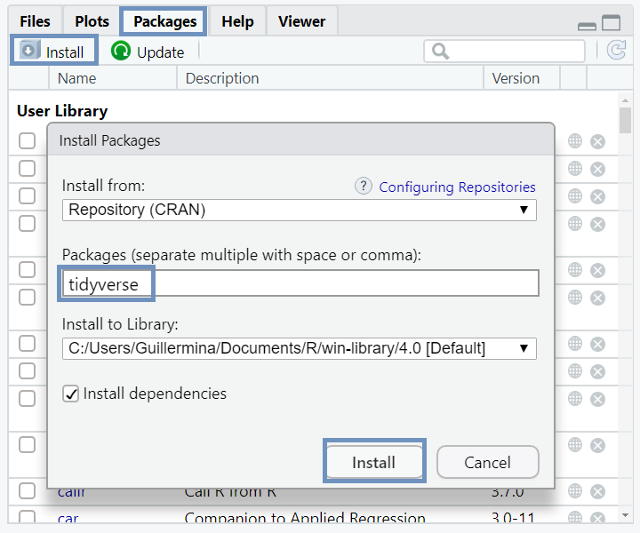

```{r setup, include=FALSE}
knitr::opts_chunk$set(echo = TRUE)
```

## ¿Qué vamos a presentar? 

* R y RStudio
     + Instalación
     + RStudio Cloud
     + Características generales
* Rproject
* Librerias y paquetes
     + ```tidyverse```
* Comandos básicos
* Clases de objetos
* Importar datos
     + ```readr```
     + algunas funciones basicas
* Obtención de ayuda

## Descarga e instalación de R y RStudio

* Descargar R

https://www.r-project.org/

* Descargar RStudio 

https://www.rstudio.com/products/rstudio/download/

* VIDEO: Tutorial para instalación

https://www.youtube.com/watch?v=ZTzbiAznSjc

* Si queremos trabajar en la nube:

https://rstudio.cloud


## Características generales
```{r, out.width='100%', fig.align='center', echo=FALSE}
knitr::include_graphics('Imagenes/general.png')
```


## ¿Qué es un project?

* *Directorio de trabajo* (working directory): aquí es donde R busca y guarda los archivos.

* Un *proyecto* permite mantener todos los archivos asociados  en un mismo lugar — datos de entrada, scripts, resultados, gráficos. 

* Hagamos un proyecto:

Haz clic en ```File > New Project```, y después:

```{r, out.width='100%', fig.align='center', echo=FALSE}

```


## Librerias y paquetes

* Un paquete es una colección de funciones, datos y documentación que permite extender las capacidades de R base.


* *Tidyverse* es un conjunto de paquetes que comparten una misma filosofía de datos y están diseñados para trabajar conjuntamente de forma natural.

* Instalemos el paquete tidyverse:
```{r, eval=FALSE}
install.packages("tidyverse")
```

* Una vez instalado el paquete, cargémoslo:
```{r, message=FALSE}
library(tidyverse)
```


***


* Otra forma de instalar paquetes:

Haz click en ```Packages > Install```, y se abre una ventana emergente.

Escribe el nombre del paquete que quieras instalar, finalmente click en ```Install```.

```{r, out.width='70%', fig.align='center', echo=FALSE}

```


## Comandos básicos

* Puedes usar R como una calculadora:
```{r}
1 / 200 * 30
(59 + 73 + 2) / 3
sin(pi / 2)
```
***

* Puedes crear objetos nuevos usando ```<-```:

   + ```nombre_objeto <- valor```
   
   + ```Alt``` + - (signo menos).
   
   + Los nombres de los objetos deben comenzar con una letra y solo pueden contener letras, números, _ y .. 
```{r}
x <- 3 * 4
```
   
* Puedes examinar un objeto escribiendo su nombre:
```{r}
x 
```
***

* Puedes crear un vector con la función ```c()```:
```{r}
v1 <- c(1, 2, 3, 4.5, "seis")
v1

v2 <- c(3, 7:10)
v2

```

* Puedes crear matrices.

## ¿Qué clases de objetos existen?

* *Vectores*

* *Matrices* y *Arrays*: Todos los elementos son numéricos   ```matrix()```

* *Listas*: pueden contener elementos de distinto tipo    ```list()```

* *Factores*: se usan para variables categóricas   ```factor()```

* *Data Frames*: se usan para almacenar datos en forma de tablas (filas / columnas). Pueden contener elementos de distinto tipo   ```data.frame()```

* *Tibbles*: dataframes con algunas particularideades por ejemplo no convierten por defecto vectores de texto en factores

* *Funciones*: argumento, cuerpo, resultado


## ¿Cómo importamos datos?
* Utilizamos la libreria ```readr``` del paquete ```tidyverse```.

     + ```read_csv()``` lee archivos delimitados por coma.

     + ```read_csv2()``` lee archivos separados por punto y coma.

     + ```read_tsv()``` lee archivos delimitados por tabulaciones.

     + ```read_delim()``` archivos con cualquier delimitador.

* El archivo ```notas.csv```, incluye una muestra de los resultados de las personas que rindieron la segunda revisión de Econometría 1 para 2017-2018 y lo pueden encontrar aquí:

https://eva.fcea.udelar.edu.uy/course/view.php?id=183&section=10

***

* Leemos el archivo ```notas.csv``` que se encuentra guardado en la misma carpeta del proyecto.
```{r, message=FALSE}
notas <- read_delim("Datos/notas.csv", delim =";")
notas <- read_csv2("Datos/notas.csv")
```

```{r, echo=FALSE}
notas
```

***
1.	Los datos pueden no tener nombres de columna. Se utiliza col_names = FALSE. 

```{r,  eval=FALSE}
read_csv2("Datos/notas.csv", col_names = FALSE)
``` 

Alternativamente,

```{r,  eval=FALSE}
read_csv2("Datos/notas.csv",col_names=c("P","S","A","M"))
``` 

2. ```na``` del inglés, “not available”, especifica el valor que se utiliza para representar los valores faltantes del archivo:

```{r,  eval=FALSE}
read_csv2("Datos/notas.csv", na = ".")
``` 
***

* Otra forma de importar datos:

Haz click en ```Environment > Import Dataset```.

```{r, out.width='40%', fig.align='center', echo=FALSE}
knitr::include_graphics('Imagenes/importacion1.png')
```

***
Se abre una ventana emergente:

```{r, out.width='100%', fig.align='center', echo=FALSE}

```

***

## Algunas funciones básicas

* Una vez importados los datos podemos hacer estas funciones:

    + ```view()``` visualiza los datos como una "tabla".
    
    + ```names()``` muestra o establece los nombres de un objeto.
    
    + ```head()``` devuelve las primeras 6 partes de un objeto.
    
    + ```tail()``` devuelve las ultimas 6 partes de un objeto.
    
    + ```dim()``` establece la dimensión de un objeto.
    
    + ```str()``` muestra de forma compacta la estructura interna de un objeto.
    
    + ```summary()``` produce resúmenes de los datos o de los resultados de funciones de ajuste de modelos.

*** 

```{r}
names(notas)

head(notas)
```
***

```{r}
dim(notas)

str(notas)
```
***

```{r}
summary(notas)
```


## Busquemos ayuda

Puedes encontrar material de ayuda en:

* Sitio web de la versión en español de “R for Data Science”, de Hadley Wickham y Garrett Grolemund. 

https://es.r4ds.hadley.nz/

* "Machetes" (cheatsheets) de Rstudio.

https://www.rstudio.com/resources/cheatsheets/

* En particular el cheatsheet de importación de datos.

https://eva.fcea.udelar.edu.uy/pluginfile.php/286031/mod_folder/content/0/data-import.pdf?forcedownload=1


## Busquemos ayuda en R

* en la consola escribe ```?``` + nombre de la función 
* en la concola escribe  ```??``` + algo parecido al nombre de la función 
* en la pestaña  ```Help``` de la salida

```{r, out.width='100%', fig.align='center', echo=FALSE}

```


## Actividad 
1. Descargar e instalar R y RStudio. Abrir RStudio.

2. Descargar la base de datos ```Notas.csv``` del EVA y guardarla en una carpeta llamada ```Taller_R_Econometria```.

3. Crear un proyecto en el directorio ya existente ```Taller_R_Econometria```.

4. Abrir un nuevo script y nombrarlo ```ActividadClase1```.

5. Descargar el paquete e instalar la librería ```tidyverse```.

6. Importar el archivo ```Notas.csv```. 

***

7. Observar los nombres de las variables, las primeras 6 líneas , la dimensión y un resumen de cada variable.

8. Relizar un gráfico de dispersión entre dos variables y un histograma de otra. (Ayuda: investiga sobre la función ```plot()```)

9. Crear un vector, con el nombre ```vector``` con los valores ```4.3456```, ```2.8888```, ```-2.25``` y ```-4```.

10. Hallar el valor absoluto de los valores de ```vector```. (Ayuda: investiga sobre la función ```abs()```)

11. Redondea los valores de ```vector``` con una cifra despues de la coma. (Ayuda: investiga sobre la función ```round()```).


