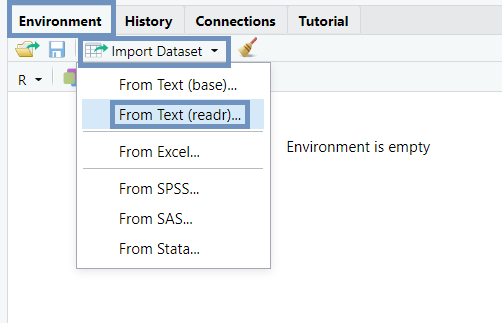

```{r setup, include=FALSE}
knitr::opts_chunk$set(echo = TRUE)
```

## ¿Qué vamos a presentar? 

* Ordenar
* Visualizar
* Modelar
* Transformar
     
```{r, out.width='100%', fig.align='center', echo=FALSE}

```
## ¿Qué vamo a necesitar?

```{r}
#Paquetes
library(tidyverse)
library(datos)

#Datos
#ECH <- read_csv() #Leo los datos d ela ECH
```

**Importante:** La función *read.csv* no es la misma que *read_csv*.


## Ordenar

Tres reglas:
Cada variable debe tener su propia columna.
Cada observación debe tener su propia fila.
Cada valor debe tener su propia celda.

Cheatsheet
```{r, out.width='100%', fig.align='center', echo=FALSE}
knitr::include_graphics('Imagenes/')
```


## Visualizar (1)

¿Los automoviles con motores grandes consumen mas combustible que los automoviles con motores pequeños?


```{r}
ggplot(data = millas) +
  geom_point(mapping = aes(x = cilindrada, y = autopista))
```

El gráfico muestra una relación negativa entre el tamaño del motor (cilindrada) y la eficiencia del combustible (autopista). En otras palabras, los vehículos con motores grandes usan más combustible. 

## Visualizar (2)
Para comenzar un gráfico con ggplot2 se utiliza la función ggplot(). ggplot() crea un sistema de coordenadas al que puedes agregar capas. El primer argumento de ggplot() es el conjunto de datos que se utilizará en el gráfico.

```{r, eval=FALSE}
ggplot(data = <DATOS>) +
  <GEOM_FUNCIÓN>(mapping = aes(<MAPEOS>))
```
Para completar tu gráfico debes agregar una o más capas a ggplot(). La función geom_point() agrega una capa de puntos al gráfico, lo que crea un diagrama de dispersión (o scatterplot). 

El argumento de mapping siempre aparece emparejado con aes() y los argumentos x e y dentro de aes() especifican qué variables asignar a estos ejes. ggplot2 busca la variable asignada en el argumento data


## Visualizar (3) - Mapeos estéticos

Para mapear (o asignar) una estética a una variable, debes asociar el nombre de la estética al de la variable dentro de aes().

```{r}
ggplot(data = millas) +
  geom_point(mapping = aes(x = cilindrada, y = autopista, color = clase))
```

ambién podríamos haber asignado la variable clase a la estética alpha, que controla la transparencia de los puntos, o a la estética shape que controla la forma (shape) de los puntos.
size = clase  estética del tamaño
alpha = clase
shape = clase


```{r, echo=FALSE}
ggplot(data = millas) +
  geom_point(mapping = aes(x = cilindrada, y = autopista, size = clase))
#> Warning: Using size for a discrete variable is not advised.


# Izquierda
ggplot(data = millas) +
  geom_point(mapping = aes(x = cilindrada, y = autopista, alpha = clase))

# Derecha
ggplot(data = millas) +
  geom_point(mapping = aes(x = cilindrada, y = autopista, shape = clase))
```

##Visualización - Separar en facetas
Para separar en facetas un gráfico según una sola variable, utiliza facet_wrap()
```{r}
ggplot(data = millas) +
  geom_point(mapping = aes(x = cilindrada, y = autopista)) +
  facet_wrap(~ clase, nrow = 2) #la variable aquei debe ser categorica
```

Para separar en facetas un gráfico según las combinaciones de dos variables, agrega facet_grid() 
```{r}
ggplot(data = millas) +
  geom_point(mapping = aes(x = cilindrada, y = autopista)) +
  facet_grid(traccion ~ cilindros)
```


## Visualización - Objetos geométricos

Un geom es el objeto geométrico usado para representar datos de forma gráfica.
los diagramas de barras usan geoms de barra (bar), los diagramas de líneas usan geoms de línea (line), los diagramas de caja usan geoms de diagrama de caja (boxplot).
los diagramas de puntos (llamados scatterplots) rompen la tendencia; ellos usan geom de punto (o point). 
los diagramas de puntos (llamados scatterplots) rompen la tendencia; ellos usan geom de punto (o point). 

```{r}
ggplot(data = millas) +
  geom_smooth(mapping = aes(x = cilindrada, y = autopista, linetype = traccion))
```

 https://exts.ggplot2.tidyverse.org/gallery/ para obtener una muestra
 consultando la hoja de referencia (o cheatsheet), que puedes encontrar en https://rstudio.com/resources/cheatsheets/
 
##VisualizaCIÓN
Para mostrar múltiples geoms en el mismo gráfico, agrega varias funciones geom a ggplot():
```{r}
ggplot(data = millas) +
 geom_point(mapping = aes(x = cilindrada, y = autopista)) +
 geom_smooth(mapping = aes(x = cilindrada, y = autopista))
```

```{r}
ggplot(data = millas, mapping = aes(x = cilindrada, y = autopista)) +
  geom_point(mapping = aes(color = clase)) +
  geom_smooth()
```


##vISUALIZACION

aLGO MAS??
COORD, STAT, position

Cheatsheet ggplot2


##Modelar

##Transformar

dplyr
En este capítulo, aprenderás las cinco funciones clave de dplyr que te permiten resolver la gran mayoría de tus desafíos de manipulación de datos:

Filtrar o elegir las observaciones por sus valores (filter() — del inglés filtrar).
Reordenar las filas (arrange() — del inglés organizar).
Seleccionar las variables por sus nombres (select() — del inglés seleccionar).
Crear nuevas variables con transformaciones de variables existentes (mutate() — del inglés mutar o transformar).
Contraer muchos valores en un solo resumen (summarise() — del inglés resumir).
Todas estas funciones se pueden usar junto con group_by() (del inglés agrupar por), que cambia el alcance de cada función para que actúe ya no sobre todo el conjunto de datos sino de grupo en grupo. 

##Filtrar filas con filter()

```{r}
filter(vuelos, mes == 1, dia == 1)
#> # A tibble: 842 x 19
#>    anio   mes   dia horario_salida salida_programa… atraso_salida
#>   <int> <int> <int>          <int>            <int>         <dbl>
#> 1  2013     1     1            517              515             2
#> 2  2013     1     1            533              529             4
#> 3  2013     1     1            542              540             2
#> 4  2013     1     1            544              545            -1
#> 5  2013     1     1            554              600            -6
#> 6  2013     1     1            554              558            -4
#> # … with 836 more rows, and 13 more variables: horario_llegada <int>,
#> #   llegada_programada <int>, atraso_llegada <dbl>, aerolinea <chr>,
#> #   vuelo <int>, codigo_cola <chr>, origen <chr>, destino <chr>,
#> #   tiempo_vuelo <dbl>, distancia <dbl>, hora <dbl>, minuto <dbl>,
#> #   fecha_hora <dttm>
```

operadores de comparación. R proporciona el conjunto estándar: >, >=, <, <=, != (no igual) y == (igual).
operadores Booleanos: & es “y”, | es “o”, y ! es “no”. 


El siguiente código sirve para encontrar todos los vuelos que partieron en noviembre o diciembre:
```{r}
filter(vuelos, mes == 11 | mes == 12)
nov_dic <- filter(vuelos, mes %in% c(11, 12))
```

##Reordenar las filas con arrange()

```{r}
arrange(vuelos, anio, mes, dia)
#> # A tibble: 336,776 x 19
#>    anio   mes   dia horario_salida salida_programa… atraso_salida
#>   <int> <int> <int>          <int>            <int>         <dbl>
#> 1  2013     1     1            517              515             2
#> 2  2013     1     1            533              529             4
#> 3  2013     1     1            542              540             2
#> 4  2013     1     1            544              545            -1
#> 5  2013     1     1            554              600            -6
#> 6  2013     1     1            554              558            -4
#> # … with 336,770 more rows, and 13 more variables: horario_llegada <int>,
#> #   llegada_programada <int>, atraso_llegada <dbl>, aerolinea <chr>,
#> #   vuelo <int>, codigo_cola <chr>, origen <chr>, destino <chr>,
#> #   tiempo_vuelo <dbl>, distancia <dbl>, hora <dbl>, minuto <dbl>,
#> #   fecha_hora <dttm>


arrange(vuelos, desc(atraso_salida))
#> # A tibble: 336,776 x 19
#>    anio   mes   dia horario_salida salida_programa… atraso_salida
#>   <int> <int> <int>          <int>            <int>         <dbl>
#> 1  2013     1     9            641              900          1301
#> 2  2013     6    15           1432             1935          1137
#> 3  2013     1    10           1121             1635          1126
#> 4  2013     9    20           1139             1845          1014
#> 5  2013     7    22            845             1600          1005
#> 6  2013     4    10           1100             1900           960
#> # … with 336,770 more rows, and 13 more variables: horario_llegada <int>,
#> #   llegada_programada <int>, atraso_llegada <dbl>, aerolinea <chr>,
#> #   vuelo <int>, codigo_cola <chr>, origen <chr>, destino <chr>,
#> #   tiempo_vuelo <dbl>, distancia <dbl>, hora <dbl>, minuto <dbl>,
#> #   fecha_hora <dttm>
```


##Seleccionar columnas con select()
```{r}
# Seleccionar columnas por nombre
select(vuelos, anio, mes, dia)
# Seleccionar todas las columnas entre anio y dia (incluyente)
select(vuelos, anio:dia)
# Seleccionar todas las columnas excepto aquellas entre anio en dia (incluyente)
select(vuelos, -(anio:dia))

```

##Añadir nuevas variables con mutate()

```{r}
vuelos_sml <- select(vuelos,
  anio:dia,
  starts_with("atraso"),
  distancia,
  tiempo_vuelo
)
mutate(vuelos_sml,
  ganancia = atraso_salida - atraso_llegada,
  velocidad = distancia / tiempo_vuelo * 60
)


mutate(vuelos_sml,
  ganancia = atraso_salida - atraso_llegada,
  horas = tiempo_vuelo / 60,
  ganacia_por_hora = ganancia / horas
)
```

Si solo quieres conservar las nuevas variables, usa transmute()

##Resúmenes agrupados con summarise()

```{r}
summarise(vuelos, atraso = mean(atraso_salida, na.rm = TRUE))
#> # A tibble: 1 x 1
#>   atraso
#>    <dbl>
#> 1   12.6
```

summarise() no es muy útil a menos que lo enlacemos con group_by().

```{r}
por_dia <- group_by(vuelos, anio, mes, dia)
summarise(por_dia, atraso = mean(atraso_salida, na.rm = TRUE))
#> `summarise()` has grouped output by 'anio', 'mes'. You can override using the `.groups` argument.
#> # A tibble: 365 x 4
#> # Groups:   anio, mes [12]
#>    anio   mes   dia atraso
#>   <int> <int> <int>  <dbl>
#> 1  2013     1     1  11.5 
#> 2  2013     1     2  13.9 
#> 3  2013     1     3  11.0 
#> 4  2013     1     4   8.95
#> 5  2013     1     5   5.73
#> 6  2013     1     6   7.15
#> # … with 359 more rows
```

## pipa
library(magrittr)
```{r}
por_destino <- group_by(vuelos, destino)
atraso <- summarise(por_destino,
  conteo = n(),
  distancia = mean(distancia, na.rm = TRUE),
  atraso = mean(atraso_llegada, na.rm = TRUE)
)
atraso <- filter(atraso, conteo > 20, destino != "HNL")

ggplot(data = atraso, mapping = aes(x = distancia, y = atraso)) +
  geom_point(aes(size = conteo), alpha = 1/3) +
  geom_smooth(se = FALSE)

```

```{r}
atrasos <- vuelos %>% 
  group_by(destino) %>% 
  summarise(
    conteo = n(),
    distancia = mean(distancia, na.rm = TRUE),
    atraso = mean(atraso_llegada, na.rm = TRUE)
  ) %>% 
  filter(conteo > 20, destino != "HNL")
```

## Funciones de resumen útiles


mean(x) #media
median(x)#mediana
desviación estándar sd(x) es una medida estándar de dispersión. El rango intercuartil IQR() y la desviación media absoluta mad(x)
min(x), quantile(x, 0.25), max(x)
Medidas de posición: first(x), nth(x, 2), last(x).
Conteos: has visto n(), que no toma argumentos y que devuelve el tamaño del grupo actual. Para contar la cantidad de valores no faltantes, usa sum(!is.na (x)). Para contar la cantidad de valores distintos (únicos), usa n_distinct(x).
Los conteos son tan útiles que dplyr proporciona un ayudante simple si todo lo que quieres es un conteo:
```{r}
no_cancelados %>% 
  count(destino)
```


## Librerias y paquetes

* Un paquete es una colección de funciones, datos y documentación que permite extender las capacidades de R base.


* *Tidyverse* es un conjunto de paquetes que comparten una misma filosofía de datos y están diseñados para trabajar conjuntamente de forma natural.

* Instalemos el paquete tidyverse:
```{r, eval=FALSE}
install.packages("tidyverse")
```

* Una vez instalado el paquete, cargémoslo:
```{r, message=FALSE}
library(tidyverse)
```


***


* Otra forma de instalar paquetes:

Haz click en ```Packages > Install```, y se abre una ventana emergente.

Escribe el nombre del paquete que quieras instalar, finalmente click en ```Install```.

```{r, out.width='70%', fig.align='center', echo=FALSE}
knitr::include_graphics('Imagenes/paquetes.png')
```


## Comandos básicos

* Puedes usar R como una calculadora:
```{r}
1 / 200 * 30
(59 + 73 + 2) / 3
sin(pi / 2)
```
***

* Puedes crear objetos nuevos usando ```<-```:

   + ```nombre_objeto <- valor```
   
   + ```Alt``` + - (signo menos).
   
   + Los nombres de los objetos deben comenzar con una letra y solo pueden contener letras, números, _ y .. 
```{r}
x <- 3 * 4
```
   
* Puedes examinar un objeto escribiendo su nombre:
```{r}
x 
```
***

* Puedes crear un vector con la función ```c()```:
```{r}
v1 <- c(1, 2, 3, 4.5, "seis")
v1

v2 <- c(3, 7:10)
v2

```

* Puedes crear matrices.

## ¿Qué clases de objetos existen?

* *Vectores*

* *Matrices* y *Arrays*: Todos los elementos son numéricos   ```matrix()```

* *Listas*: pueden contener elementos de distinto tipo    ```list()```

* *Factores*: se usan para variables categóricas   ```factor()```

* *Data Frames*: se usan para almacenar datos en forma de tablas (filas / columnas). Pueden contener elementos de distinto tipo   ```data.frame()```

* *Tibbles*: dataframes con algunas particularideades por ejemplo no convierten por defecto vectores de texto en factores

* *Funciones*: argumento, cuerpo, resultado


## ¿Cómo importamos datos?
* Utilizamos la libreria ```readr``` del paquete ```tidyverse```.

     + ```read_csv()``` lee archivos delimitados por coma.

     + ```read_csv2()``` lee archivos separados por punto y coma.

     + ```read_tsv()``` lee archivos delimitados por tabulaciones.

     + ```read_delim()``` archivos con cualquier delimitador.

* El archivo ```notas.csv```, incluye una muestra de los resultados de las personas que rindieron la segunda revisión de Econometría 1 para 2017-2018 y lo pueden encontrar aquí:

https://eva.fcea.udelar.edu.uy/course/view.php?id=183&section=10

***

* Leemos el archivo ```notas.csv``` que se encuentra guardado en la misma carpeta del proyecto.
```{r, message=FALSE}
notas <- read_delim("Datos/notas.csv", delim =";")
notas <- read_csv2("Datos/notas.csv")
```

```{r, echo=FALSE}
notas
```

***
1.	Los datos pueden no tener nombres de columna. Se utiliza col_names = FALSE. 

```{r,  eval=FALSE}
read_csv2("Datos/notas.csv", col_names = FALSE)
``` 

Alternativamente,

```{r,  eval=FALSE}
read_csv2("Datos/notas.csv",col_names=c("P","S","A","M"))
``` 

2. ```na``` del inglés, “not available”, especifica el valor que se utiliza para representar los valores faltantes del archivo:

```{r,  eval=FALSE}
read_csv2("Datos/notas.csv", na = ".")
``` 
***

* Otra forma de importar datos:

Haz click en ```Environment > Import Dataset```.

```{r, out.width='40%', fig.align='center', echo=FALSE}

```

***
Se abre una ventana emergente:

```{r, out.width='100%', fig.align='center', echo=FALSE}
knitr::include_graphics('Imagenes/importacion2.png')
```

***

## Algunas funciones básicas

* Una vez importados los datos podemos hacer estas funciones:

    + ```view()``` visualiza los datos como una "tabla".
    
    + ```names()``` muestra o establece los nombres de un objeto.
    
    + ```head()``` devuelve las primeras 6 partes de un objeto.
    
    + ```tail()``` devuelve las ultimas 6 partes de un objeto.
    
    + ```dim()``` establece la dimensión de un objeto.
    
    + ```str()``` muestra de forma compacta la estructura interna de un objeto.
    
    + ```summary()``` produce resúmenes de los datos o de los resultados de funciones de ajuste de modelos.

*** 

```{r}
names(notas)

head(notas)
```
***

```{r}
dim(notas)

str(notas)
```
***

```{r}
summary(notas)
```


## Busquemos ayuda

Puedes encontrar material de ayuda en:

* Sitio web de la versión en español de “R for Data Science”, de Hadley Wickham y Garrett Grolemund. 

https://es.r4ds.hadley.nz/

* "Machetes" (cheatsheets) de Rstudio.

https://www.rstudio.com/resources/cheatsheets/

* En particular el cheatsheet de importación de datos.

https://eva.fcea.udelar.edu.uy/pluginfile.php/286031/mod_folder/content/0/data-import.pdf?forcedownload=1


## Busquemos ayuda en R

* en la consola escribe ```?``` + nombre de la función 
* en la concola escribe  ```??``` + algo parecido al nombre de la función 
* en la pestaña  ```Help``` de la salida

```{r, out.width='100%', fig.align='center', echo=FALSE}
knitr::include_graphics('Imagenes/ayuda.png')
```


## Actividad 
1. Descargar e instalar R y RStudio. Abrir RStudio.

2. Descargar la base de datos ```Notas.csv``` del EVA y guardarla en una carpeta llamada ```Taller_R_Econometria```.

3. Crear un proyecto en el directorio ya existente ```Taller_R_Econometria```.

4. Abrir un nuevo script y nombrarlo ```ActividadClase1```.

5. Descargar el paquete e instalar la librería ```tidyverse```.

6. Importar el archivo ```Notas.csv```. 

***

7. Observar los nombres de las variables, las primeras 6 líneas , la dimensión y un resumen de cada variable.

8. Relizar un gráfico de dispersión entre dos variables y un histograma de otra. (Ayuda: investiga sobre la función ```plot()```)

9. Crear un vector, con el nombre ```vector``` con los valores ```4.3456```, ```2.8888```, ```-2.25``` y ```-4```.

10. Hallar el valor absoluto de los valores de ```vector```. (Ayuda: investiga sobre la función ```abs()```)

11. Redondea los valores de ```vector``` con una cifra despues de la coma. (Ayuda: investiga sobre la función ```round()```).


